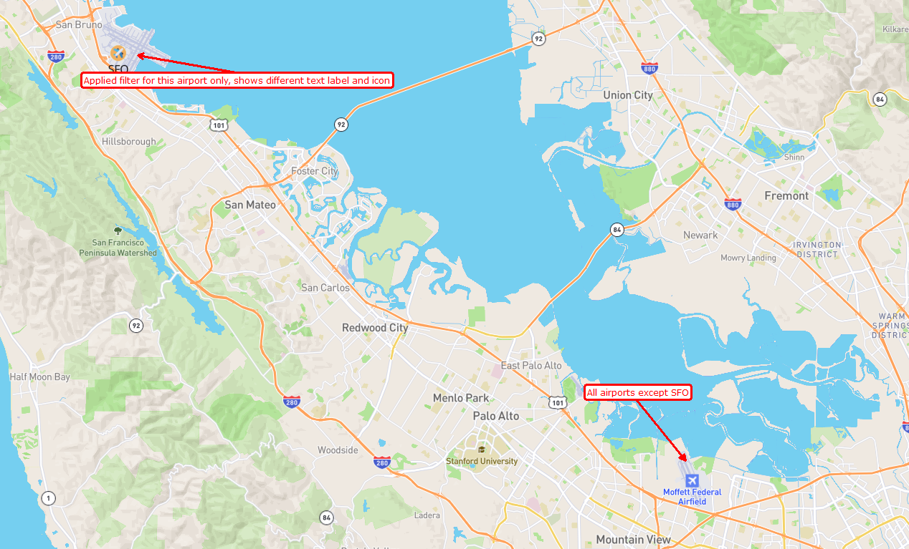

# mapbox-palo-alto

1. I took a standard map from mapbox. And then tried to make it similar to https://developer.apple.com/maps/web/ palo alto map.

   - Changed city label colors
   - Changed road number shields
   - Updated airport label to blue
   - Changed airport label icon ( I made svg myself, it was hard to find the exat same icon :) )
   - Added filter for SFO and changed its label icon

   
